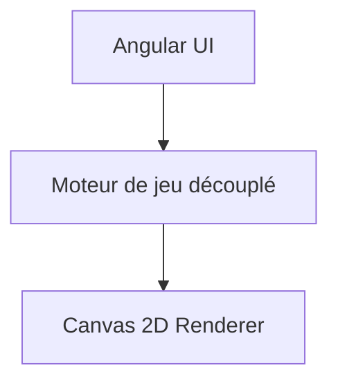

# 🧱 Tetrigular

Jeu Tetris-like développé en **Angular standalone (TypeScript strict)**
avec moteur de jeu découplé et rendu **Canvas 2D**. Déployé sur
infrastructure personnelle via **runner GitHub self-hosted + Docker**.

[](https://github.com/arnaud-wissart-lab/Tetrigular/actions/workflows/ci.yml)
[](https://github.com/arnaud-wissart-lab/Tetrigular/actions/workflows/deploy-manual.yml)

------------------------------------------------------------------------

## 🎮 Démo live

👉 http://tetris.arnaudwissart.fr


------------------------------------------------------------------------

## 💡 Pourquoi ce projet ?

Tetrigular démontre :

-   Architecture Angular moderne (standalone components)
-   Séparation moteur de jeu / rendu graphique
-   Gestion fine des contrôles (DAS / ARR)
-   CI complète (lint, tests, build, audit sécurité)
-   Déploiement Docker automatisé via workflow GitHub Actions
-   Runner self-hosted Linux

Projet volontairement simple fonctionnellement mais exigeant
techniquement.

------------------------------------------------------------------------

## 🏗 Architecture



------------------------------------------------------------------------

## 🔧 Stack technique

-   Angular standalone
-   TypeScript strict
-   Canvas 2D API
-   ESLint (Angular ESLint)
-   Prettier
-   Tests unitaires (CI)
-   Docker (nginx runtime)
-   GitHub Actions (runner self-hosted)

------------------------------------------------------------------------

## 🚀 Lancement local

### Prérequis

-   Node.js \>= 20.19.0
-   npm \>= 9

``` bash
npm ci
npm start
```

Application disponible sur : http://localhost:4200

------------------------------------------------------------------------

## 🐳 Build & Docker

### Build production

``` bash
npm run build
```

### Image Docker

``` bash
docker build -t tetrigular .
docker run --rm -p 8080:80 tetrigular
```

Accessible sur : http://localhost:8080

------------------------------------------------------------------------

## 🔐 Déploiement home

Déploiement via workflow GitHub Actions (`Déploiement Manuel`) en
`workflow_dispatch`.

-   Rebuild image Docker
-   Déploiement via SSH sur `geekom-a5`
-   Redémarrage du conteneur `tetris`
-   Port exposé : `8081`

Secrets requis (organisation) : - `SSH_HOST` - `SSH_USER` -
`SSH_PRIVATE_KEY` - `SSH_PORT`

------------------------------------------------------------------------

## 🎮 Contrôles

-   ← / → : déplacement
-   ↓ (maintenu) : accélération
-   Espace : chute instantanée
-   ↑ : rotation
-   P : pause / reprise

------------------------------------------------------------------------

## 🧪 Scripts principaux

-   `npm run start`
-   `npm run build`
-   `npm run lint`
-   `npm run format`
-   `npm run test`
-   `npm run audit`
-   `npm run ci`

------------------------------------------------------------------------

## 🔄 Mise à jour dépendances

``` bash
npm outdated
npm update
npx ng update
npm run ci
```

Dependabot configuré (hebdomadaire, max 5 PR ouvertes).

------------------------------------------------------------------------

## 🎯 Objectif

Tetrigular est un projet démonstrateur mettant en avant :

-   qualité de code frontend
-   structuration moteur/affichage
-   automatisation CI/CD
-   déploiement reproductible personnel

Il sert de vitrine technique frontend moderne.
