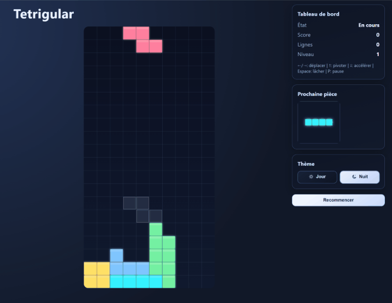
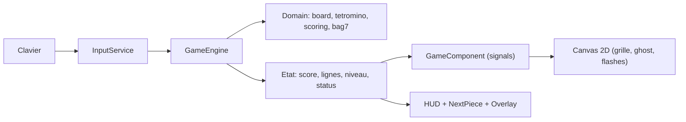

# Tetrigular
Jeu Tetris-like Angular conçu comme vitrine frontend: jouabilité clavier, moteur découplé et qualité logicielle industrialisée.

## Badges
[](https://github.com/arnaud-wissart/tetrigular/actions/workflows/ci.yml)
[](https://github.com/arnaud-wissart/tetrigular/actions/workflows/deploy-manual.yml)
[](./LICENSE)

## Démo live
- Démo live: [http://tetris.arnaudwissart.fr](http://tetris.arnaudwissart.fr)

## Ce que ça démontre
- Architecture front séparée par responsabilités: `src/app/core/input`, `src/app/game/domain`, `src/app/game/engine`, `src/app/ui`.
- Moteur de jeu découplé (`GameEngine`) avec boucle `requestAnimationFrame`.
- Jouabilité clavier complète avec DAS/ARR (`120 ms` / `30 ms`), soft drop, hard drop, rotations et pause.
- Scoring déterministe (`100 / 300 / 500 / 800`) et progression du niveau toutes les 10 lignes.
- Randomizer `7-bag` (`Bag7Randomizer`) pour la distribution des tétriminos.
- Rendu Canvas 2D avec ghost piece, animation des lignes effacées et aperçu de la prochaine pièce.
- Qualité front outillée: ESLint, tests unitaires, build production, audit sécurité et CI GitHub Actions.
- Chaîne de livraison documentée: workflow de déploiement manuel + image Docker Nginx.

## Captures



## Architecture


## Stack technique
- Runtime: Node.js `20.19.0` (`.node-version`) et npm `>=9` (`package.json > engines`).
- Package manager: npm (`packageManager: npm@11.6.2`).
- Frontend: Angular `^21.1.0`, Angular Router `^21.1.5`, TypeScript `~5.9.2`, RxJS `~7.8.0`.
- Qualité: ESLint `^9.39.3`, `angular-eslint` `21.2.0`, Prettier `^3.8.1`.
- Conteneurisation: `Dockerfile` multi-stage (`node:20-alpine` build, `nginx:alpine` runtime).
- CI/CD: `.github/workflows/ci.yml` et `.github/workflows/deploy-manual.yml`.

## Démarrage rapide (dev local)
```bash
npm ci
npm run start
```

Ouvrir l'URL locale affichée par Angular CLI.

### Contrôles
- `←` / `→`: déplacement horizontal (DAS/ARR).
- `↓` (maintenu): soft drop.
- `Espace`: hard drop.
- `↑` ou `X`: rotation horaire.
- `Z`: rotation anti-horaire.
- `P`: pause / reprise.

## Tests
```bash
npm run test
npm run test:ci
npm run lint
npm run build:prod
npm run ci
```

- Unitaires: `npm run test` et `npm run test:ci`.
- Intégration: TODO (pas de commande dédiée détectée).
- E2E: TODO (aucune configuration e2e détectée).

## Sécurité & configuration
- Variables applicatives `.env`: aucune variable requise détectée côté application.
- Variables d'environnement référencées dans CI/déploiement:

| Variable | Usage | Exemple (placeholder) |
| --- | --- | --- |
| `CI` | `.github/workflows/ci.yml` et `scripts/audit-ci.mjs` | `<true_or_false>` |
| `SSH_HOST` | Secret GitHub Actions (`deploy-manual.yml`) | `<ssh_host>` |
| `SSH_USER` | Secret GitHub Actions (`deploy-manual.yml`) | `<ssh_user>` |
| `SSH_PRIVATE_KEY` | Secret GitHub Actions (`deploy-manual.yml`) | `<private_key_pem>` |
| `SSH_PORT` | Secret GitHub Actions (`deploy-manual.yml`, optionnel) | `<22>` |
| `GITHUB_TOKEN` | Token workflow (`deploy-manual.yml`) | `<github_token>` |

- Audit sécurité dépendances production: `npm run audit` (`npm audit --omit=dev --audit-level=high`).
- Détails opérationnels de déploiement: [docs/RUNBOOK.md](./docs/RUNBOOK.md).

## Licence
Licence : MIT
